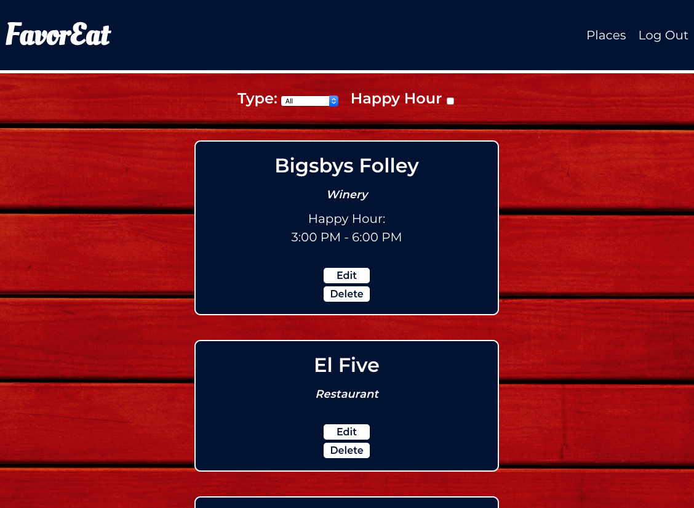
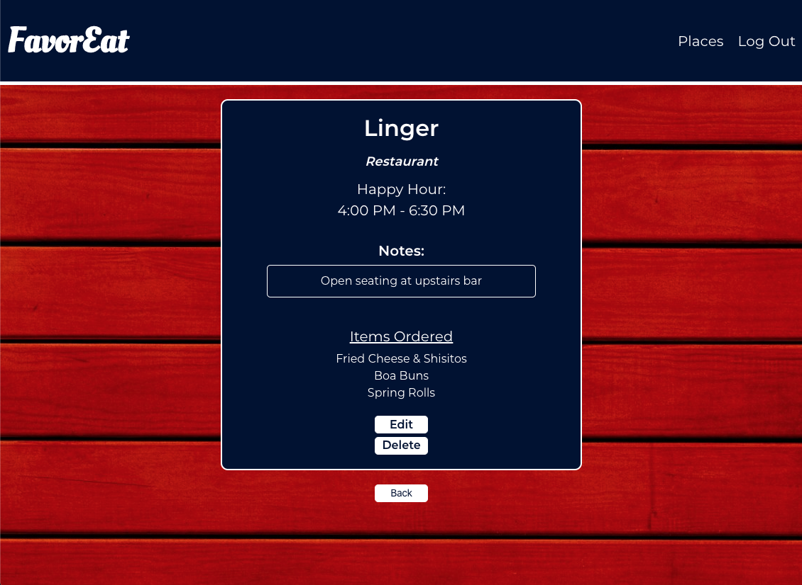
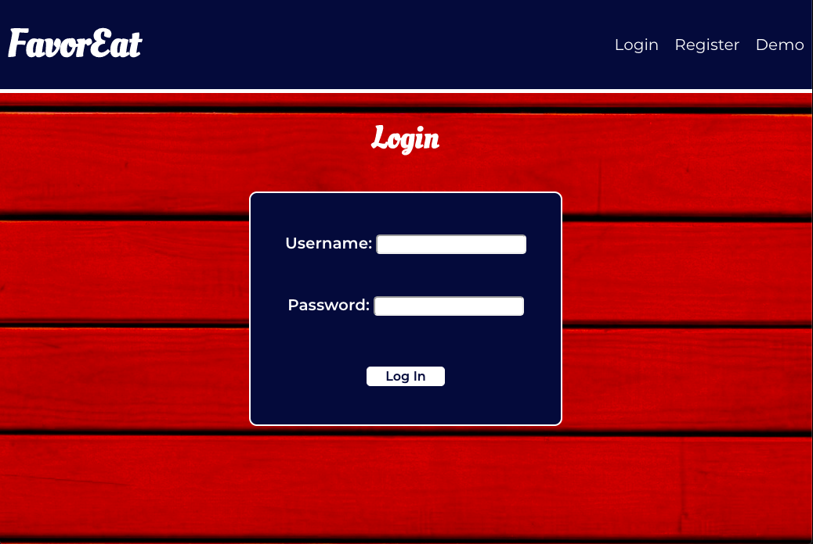
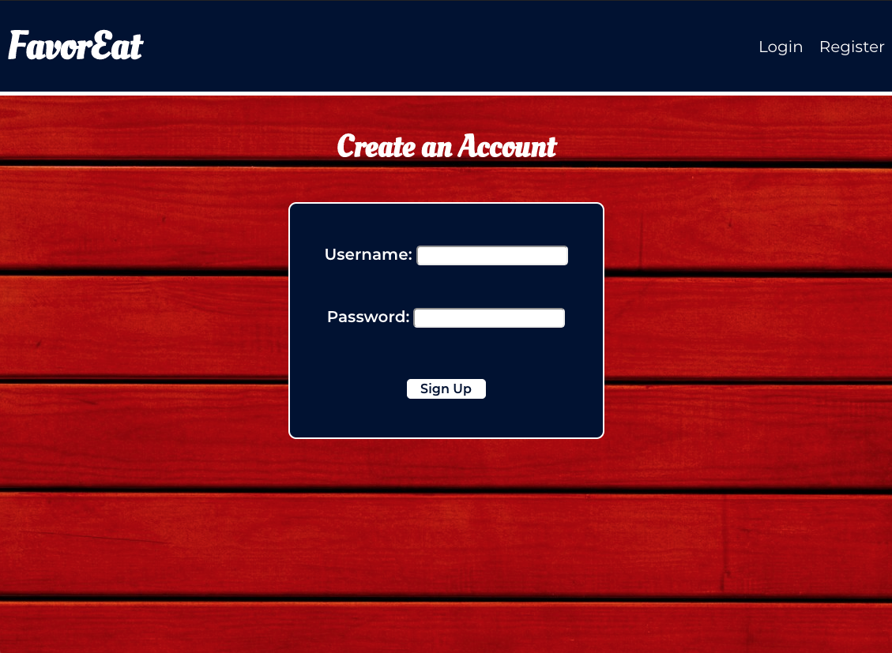

# FavorEat API

Link to Live App: https://favoreat.now.sh/

## FavorEat is a full-stack web based application that allows users to create an account and add their favorite restaurants, bars, breweries, and more.

 Users can login to view their saved places, filter by establishment type, see which places offer happy hour, and view information like notes and previous orders. Users are also able to edit their existing places and add new menu items they've tried. They can also add notes to each place to capture any information not covered by the other fields. 

The FavorEat client makes calls to this API for user authentication, adding new users to the database, retreiving
a user's data, and manipulating said data.

## Built With:
- Node.js
- Express.js
- Knex
- PostgreSQL

## Endpoints

### Root Endpoint: https://lit-taiga-88534.herokuapp.com/api

Note: user_id and Authorization need to be set as Headers for all requests to /places endpoints. The user_id and bearer token are returned from the /auth/login endpoint after successfully logging in. 

### /places
 - GET: Returns user's places formatted as JSON
 - POST: Adds a new places
 - Request Requirements:
    - Headers
        - Authorization: bearer [your jwt token]
        - user_id: [your user id]

 

### /places/:place_id
- GET: Returns a specific place from a user's places
- DELETE: Removes a place from a user's places
- PATCH: Edits a place
- Request Requirements:
    - Headers
        - Authorization: bearer [your jwt token]
        - user_id: [your user id]
    - Query Paramters
        - /place_id

 

### /auth/login
- POST: submits the username & password entered in the Login form
- Request requirements: 
    - Headers
        - content-type: application/json
    - Body
        - {user_name, password} formatted as JSON 

### /users
- POST: Registers a new username & password combination if the requirements are met
- Request Requirements:
    - Headers
        - content-type: application/json
    - Body
        - {user_name, password} formatted as JSON

 

